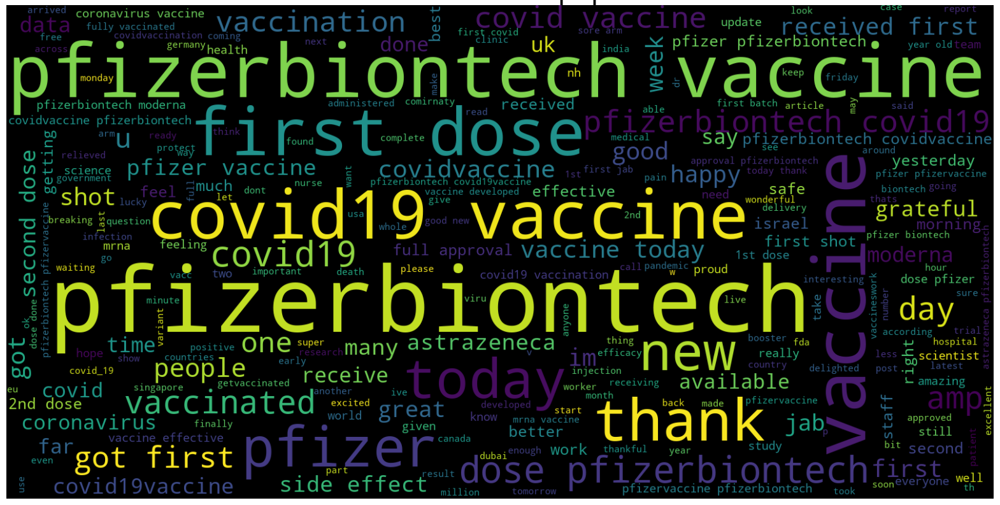
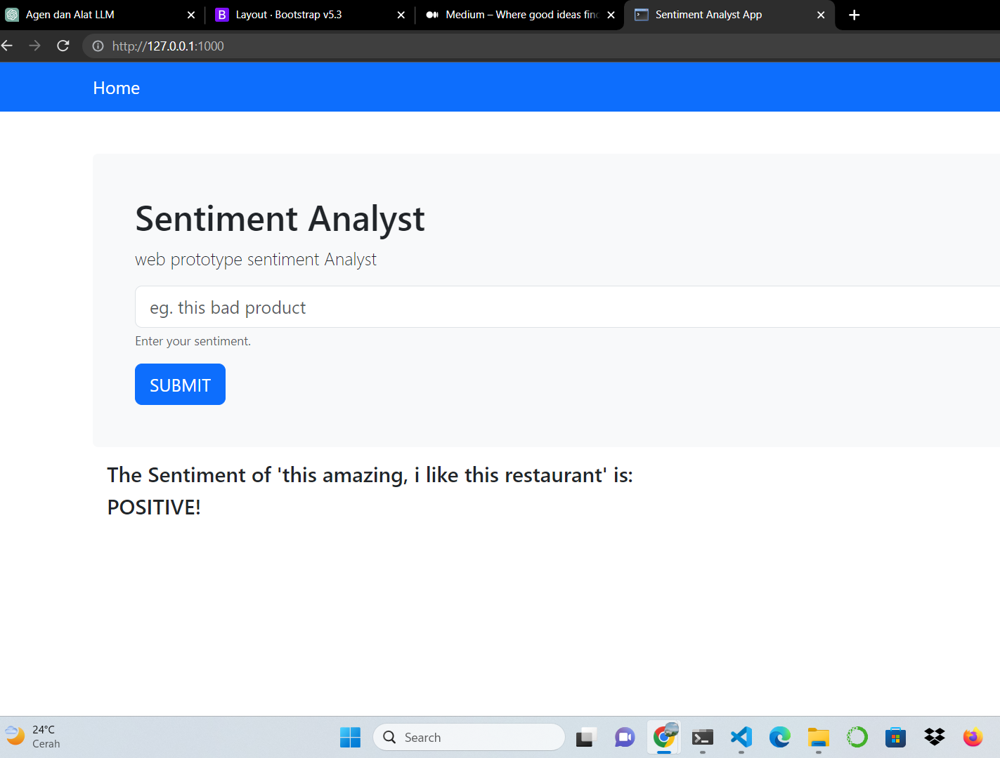

# Project NLP
In this NLP project, we harness the capabilities of Scikit-learn and NLTK libraries to delve into sentiment analysis. 
One of the captivating projects I have undertaken involves the classification of film genres, covid vaccine and restaurant reviews, 
determining their sentiment as either positive or negative based on user feedback.

# Web Application for Sentiment Analysis of Restaurant Reviews
As part of this project, we have developed a user-friendly web application that allows users to analyze the sentiment of restaurant reviews. 
With the help of intuitive visualizations and insightful sentiment scores, users can gain valuable insights into the overall sentiment of the reviews.

